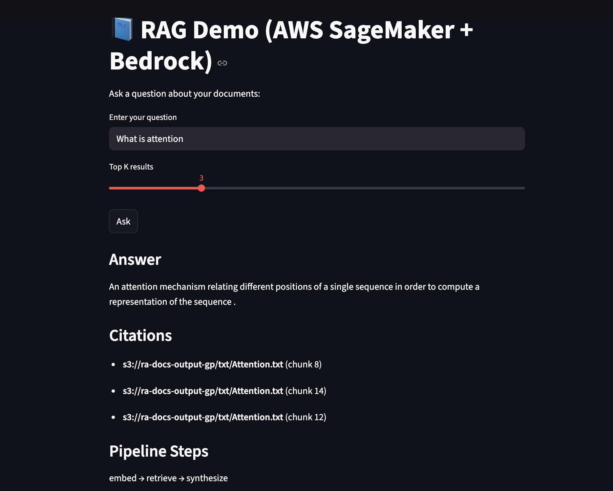

# TitanRAG on AWS 
### - End-to-End Retrieval-Augmented Generation

This project is a **serverless RAG pipeline** fully built on **AWS managed services**.
You upload PDFs → they’re converted into text → chunked & embedded → stored in Aurora PostgreSQL with **pgvector** → queried via **SageMaker + Bedrock Titan models** → exposed through **API Gateway + Lambda** → and finally connected to a **Streamlit web UI** where you can ask questions.

---

## 🔹 Architecture

```text
                  ┌──────────────┐
   Upload PDF →   │   S3 Input   │
                  └──────┬───────┘
                         │ Trigger
                         ▼
                  ┌──────────────┐
                  │   Lambda     │  
                  │  (chunk +    │
                  │  embed text) │
                  └──────┬───────┘
                         │
                         ▼
                  ┌──────────────┐
                  │ Aurora (RDS) │  
                  │ + pgvector   │
                  └──────────────┘
                         │
             ┌───────────┴────────────┐
             │ Retrieval + Generation │
             │   SageMaker Endpoint   │
             │ (Titan Embed + Titan   │
             │ Text Express)          │
             └───────────┬────────────┘
                         │
                  ┌──────▼──────┐
                  │   Lambda    │  
                  │   Adapter   │
                  └──────┬──────┘
                         │
                  ┌──────▼──────┐
                  │ API Gateway │ → Public HTTPS endpoint
                  └──────┬──────┘
                         │
                  ┌──────▼──────┐
                  │  Streamlit  │ (frontend)
                  └─────────────┘
```

---

## 🔹 Features

* **📂 Upload PDFs** → automatically chunked & embedded
* **🧮 Titan Embeddings v2** → semantic search ready
* **🗄️ Aurora PostgreSQL (pgvector)** → stores vectors + chunks
* **🤖 Titan Text Express** → synthesizes natural language answers
* **⚡ SageMaker Serverless** → no idle costs
* **🌐 API Gateway + Lambda** → clean HTTPS endpoint
* **🖥️ Streamlit UI** → ask questions interactively in browser

---

## 🔹 Setup Guide

### 1. Prerequisites

* AWS account 
* AWS CLI installed & configured
* Python 3.10+ locally

---

### 2. Create S3 Buckets

* One bucket for **raw PDFs** (`ra-docs-input-*`)
* One bucket for **processed TXT + models** (`ra-docs-output-*`)

---

### 3. Aurora PostgreSQL + pgvector

1. Create an **Aurora PostgreSQL Serverless v2** cluster.
2. Enable **RDS Data API**.
3. Connect to DB and create:

   * `vector` extension
   * `ra_chunks` table
   * HNSW index on embeddings

---

### 4. Ingestion Lambda

* Triggered on **S3 input bucket**.
* Extracts text from PDF, chunks it, generates embeddings (Titan), inserts into Aurora.
* Outputs chunked TXT into output bucket.

---

### 5. SageMaker Endpoint

* Package inference code & upload to S3 as a `.tar.gz`.
* Create **SageMaker Model** with:

  * Image: scikit-learn container
  * Env vars: DB cluster ARN, secret ARN, Bedrock model IDs, etc.
* Create **serverless endpoint config** and deploy endpoint.
* Test via CLI (`invoke-endpoint`).

---

### 6. API Gateway + Lambda Adapter

* Create a Lambda that forwards API calls to the SageMaker endpoint.
* Grant it `sagemaker:InvokeEndpoint`.
* Create an **HTTP API Gateway**:

  * Route: `POST /query`
  * Integration: Lambda
  * Enable **CORS** (`*` origin, POST + OPTIONS).
* Deploy a stage (e.g. `prod`).
* Copy the **Invoke URL** for frontend use.

---

### 7. Streamlit Frontend

* A simple UI where users type a question, send it to API Gateway, and get back an answer + citations.
* Run locally with `streamlit run app.py`.
* API calls use the Invoke URL from API Gateway.

---

## 🔹 Example Flow

1. Upload `Attention.pdf` into input bucket.
2. Lambda processes → embeddings stored in Aurora.
3. User opens Streamlit → types:

   > “Summarize key points from Attention”
4. API Gateway → Lambda → SageMaker → Aurora → Bedrock Titan → answer returned.
5. Streamlit displays answer + source citations.

---

## Results
  
## 🔹 Next Steps

* 🔒 Add auth (Cognito or IAM auth in API Gateway)
* 📊 Add metrics in CloudWatch
* ☁️ Host Streamlit via App Runner or ECS for production

---

